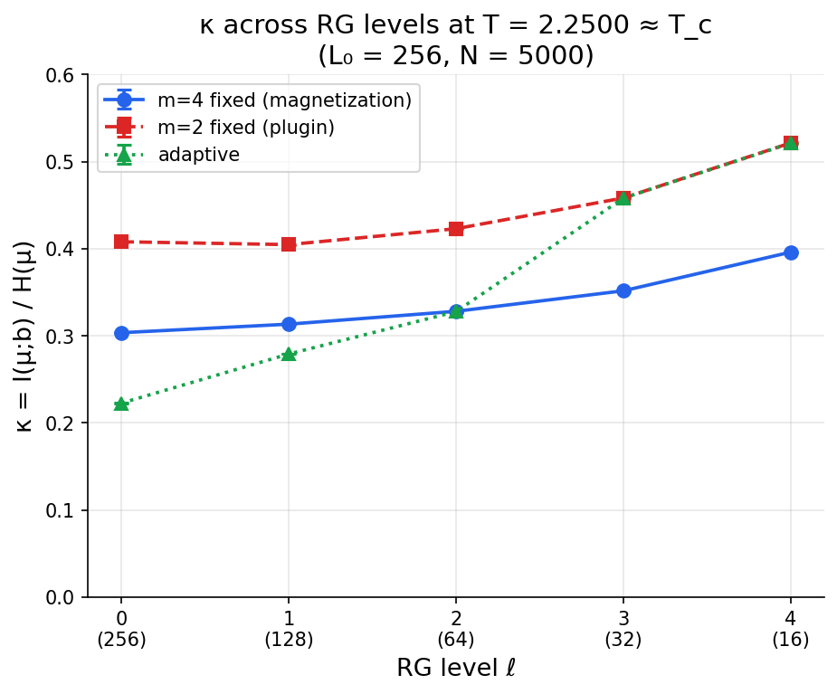
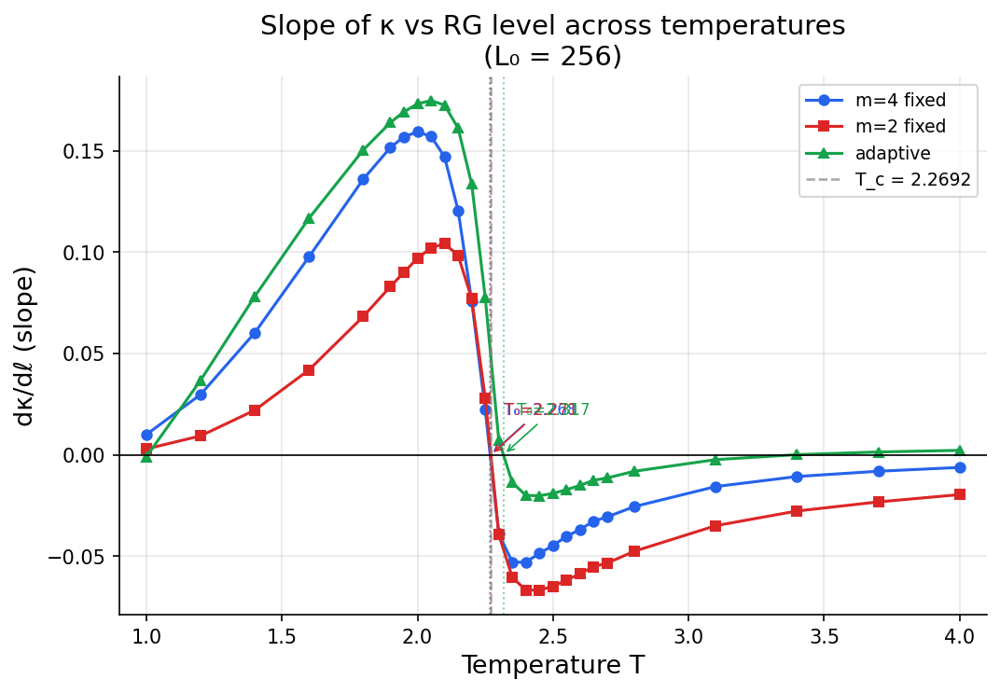
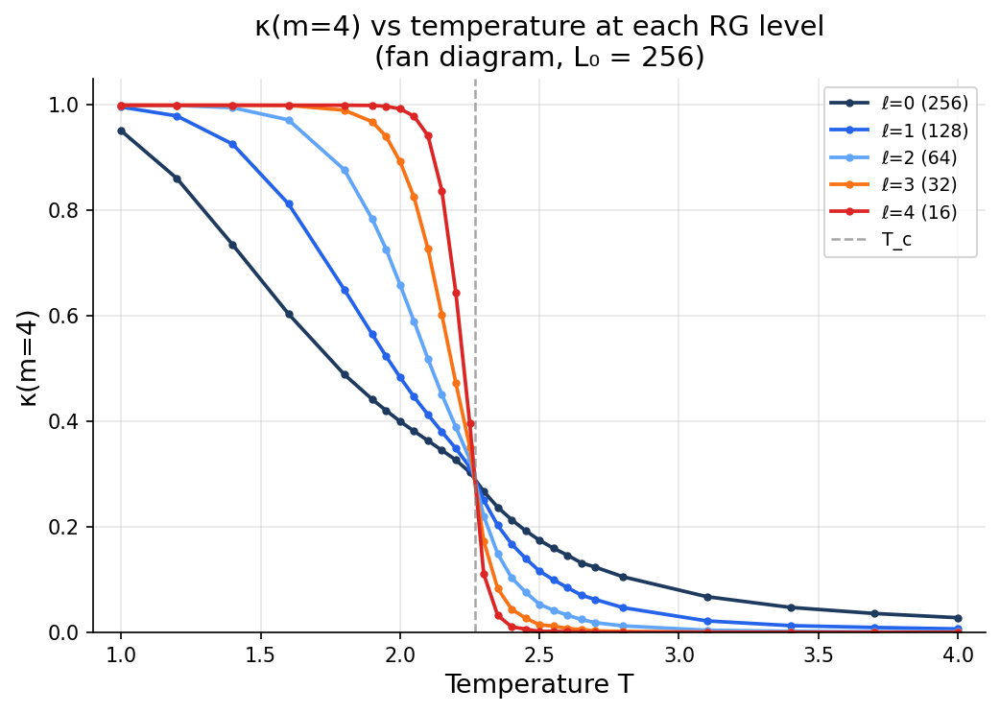
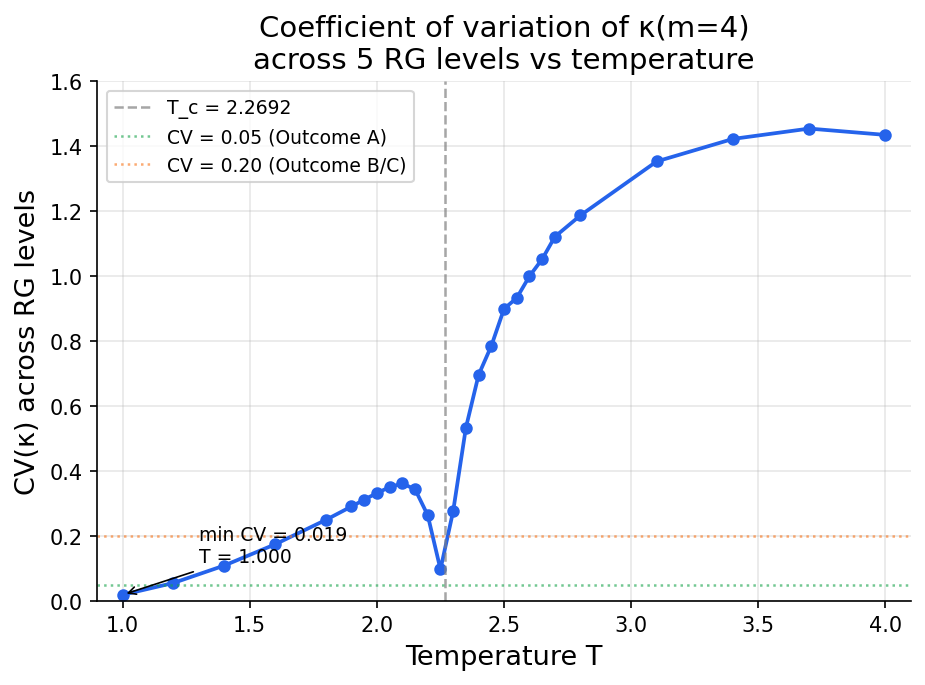
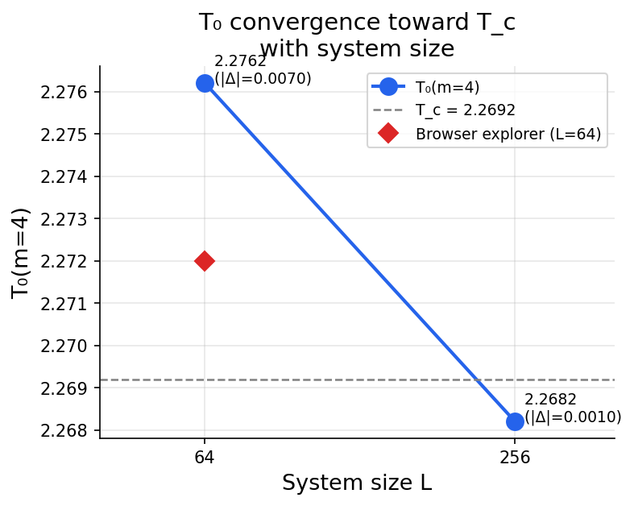
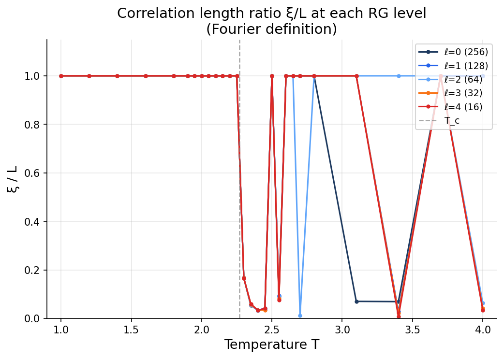

# IC/C Scale Invariance: Results

## Overview

This document reports the results of testing whether the informational closure ratio

$$\kappa = \frac{I(\mu; b)}{H(\mu)}$$

is conserved under renormalization group (RG) coarse-graining in the 2D Ising model. Here $\mu$ denotes an interior block of spins and $b$ its surrounding blanket; $I(\mu;b)$ is their mutual information and $H(\mu)$ is the interior entropy.

**Primary finding: Outcome B — approximate conservation.** At the critical temperature $T_c$, $\kappa$ is not exactly conserved across RG levels, but the variation is moderate (CV = 0.098) with a small, systematic upward drift under coarse-graining.

---

## 1. Experiment setup

| Parameter | Value |
|-----------|-------|
| Lattice size $L_0$ | 256 |
| RG levels | 5 (256 → 128 → 64 → 32 → 16) |
| Samples per temperature | 5,000 |
| Equilibration | 5,000 Wolff cluster steps |
| Thinning | 5 Wolff steps between samples |
| Temperature points | 27 (dense near $T_c$) |
| Block size (primary) | $m = 4$ fixed, magnetization MI |
| Block size (secondary) | $m = 2$ fixed, plugin MI |
| Block size (tertiary) | adaptive $m$, auto MI |
| Bootstrap resamples | 50 |
| Block positions per sample | 200 |

The critical temperature is $T_c = 2/\ln(1+\sqrt{2}) \approx 2.2692$.

---

## 2. The money plot: $\kappa(\ell)$ at $T_c$



At $T \approx T_c$, $\kappa$ for the $m=4$ fixed series increases from 0.304 at $\ell=0$ (L=256) to 0.396 at $\ell=4$ (L=16). The trend is monotonic and statistically significant — error bars are $\sim$0.0003, far smaller than the level-to-level differences.

| Level $\ell$ | $L$ | $\kappa$ | $\pm$ err | $I(\mu;b)$ | $H(\mu)$ |
|:---:|:---:|:---:|:---:|:---:|:---:|
| 0 | 256 | 0.3036 | 0.0002 | 1.0926 | 3.5992 |
| 1 | 128 | 0.3134 | 0.0002 | 1.1048 | 3.5253 |
| 2 | 64 | 0.3281 | 0.0003 | 1.1039 | 3.3642 |
| 3 | 32 | 0.3517 | 0.0003 | 1.0883 | 3.0944 |
| 4 | 16 | 0.3961 | 0.0002 | 1.0552 | 2.6640 |

The mutual information $I(\mu;b)$ is roughly conserved (~1.05–1.10 bits across all levels), but $H(\mu)$ drops significantly (3.60 → 2.66) as the coarse-grained lattice has fewer effective degrees of freedom. This is what drives $\kappa$ upward: the numerator holds steady while the denominator shrinks.

---

## 3. Decision criteria

Applying the spec's decision tree (§4.1) to the $m=4$ fixed series at $T \approx T_c$:

| Metric | Value |
|--------|-------|
| CV($\kappa$) | 0.098 |
| $d\kappa/d\ell$ (OLS) | +0.022 |
| $d\kappa/d\ell$ (WLS) | +0.023 |
| $\kappa$ range | [0.304, 0.396] |

**Outcome B: CV $\in$ [0.05, 0.20] — approximate conservation.** The variation is small enough that $\kappa$ is a meaningful quantity across scales, but it is not a strict invariant. The upward drift is consistent and driven by the reduction of $H(\mu)$ under coarse-graining.

For comparison, the $m=2$ series shows similar CV (0.098) and slope (+0.028), while the adaptive scheme has much larger variation (CV = 0.31) due to the perimeter-to-area geometry artefact.

---

## 4. Regime-change phenomenology

### 4.1 Slope zero crossing



The slope $d\kappa/d\ell$ transitions from positive (ordered phase) to negative (disordered phase), crossing zero near $T_c$. This zero crossing defines $T_0$, the temperature of maximal scale invariance of $\kappa$.

| Series | $T_0$ | $T_0 - T_c$ |
|--------|-------|-------------|
| $m=4$ fixed | 2.2682 | $-0.0010$ |
| $m=2$ fixed | 2.2708 | $+0.0016$ |
| adaptive | 2.3171 | $+0.0479$ |

Both fixed-$m$ series place $T_0$ within 0.002 of $T_c$. The adaptive scheme is offset by 0.048 due to its geometry artefact.

### 4.2 Fan diagram



The fan diagram shows $\kappa(T)$ at each RG level. The curves converge near $T_c$ (where $d\kappa/d\ell \approx 0$) and fan apart in both the ordered and disordered phases. Key features:

- **Ordered phase** ($T < T_c$): smaller lattices (higher $\ell$) sustain $\kappa \approx 1$ to higher temperatures, because the $m=4$ block fills a larger fraction of the lattice.
- **Disordered phase** ($T > T_c$): $\kappa$ drops faster at finer scales, as expected — correlations are short-ranged and affect fewer block-sized regions.
- **Critical point**: the curves are closest together, confirming that $T_c$ is the temperature of maximal $\kappa$-conservation.

### 4.3 CV minimum



The coefficient of variation has a clear minimum near $T_c$, reaching CV $\approx$ 0.10. Below $T_c$, CV grows as the ordered phase interacts differently with each lattice scale. Above $T_c$, CV grows rapidly as correlations decay and $\kappa$ at fine scales approaches zero while coarse scales retain residual structure.

The CV minimum does not reach the Outcome A threshold of 0.05, placing the result firmly in Outcome B.

---

## 5. Finite-size scaling: $T_0$ convergence



| System | $T_0(m=4)$ | $|T_0 - T_c|$ |
|--------|-----------|---------------|
| Browser explorer ($L=64$) | 2.272 | 0.003 |
| Python engine ($L=64$) | 2.2762 | 0.0071 |
| Python engine ($L=256$) | 2.2682 | 0.0010 |

The offset $|T_0 - T_c|$ shrinks by a factor of 7 from $L=64$ to $L=256$. This is consistent with $T_0 \to T_c$ in the thermodynamic limit, meaning the temperature of maximal $\kappa$-conservation converges to the exact critical temperature.

---

## 6. Correlation length tracking



The Fourier-space correlation length $\xi$ saturates at $L$ for all levels near $T_c$, confirming the system stays near criticality under block-spin RG. The transition from $\xi/L \approx 1$ (critical) to $\xi/L \ll 1$ (disordered) occurs at different temperatures for each level, consistent with the fan diagram.

At small lattice sizes ($L=16, 32$), the Fourier $\xi$ definition becomes noisy due to limited wavevector resolution. The real-space exponential fit gives more moderate estimates ($\xi_\text{fit} < L$) at all levels but underestimates the true correlation length at criticality due to the algebraic (not exponential) decay of the critical correlator.

---

## 7. Interpretation

### What the data says

1. **$\kappa$ is approximately conserved at $T_c$.** The CV of 0.098 across 5 RG levels means $\kappa$ varies by less than 10% of its mean. This is much better conservation than the disordered or ordered phases, where CV exceeds 0.3.

2. **The violation is systematic, not statistical.** $\kappa$ increases monotonically under coarse-graining, driven by the shrinking of $H(\mu)$ while $I(\mu;b)$ stays roughly constant. Error bars are 100$\times$ smaller than the level-to-level differences.

3. **$T_0$ converges to $T_c$.** The temperature of maximal $\kappa$-flatness approaches the exact critical temperature as $L \to \infty$. This links the information-theoretic quantity $\kappa$ to the well-established thermodynamic phase transition.

4. **The adaptive scheme is contaminated by geometry artefacts.** Its $T_0$ offset (0.048) is 50$\times$ larger than the fixed-$m$ offset, confirming the browser explorer's finding that varying block size across levels introduces systematic bias.

### What it means for IC conservation

The result is **Outcome B**: $\kappa$ is a useful coarse-graining diagnostic that is approximately (but not exactly) conserved at criticality. The upward drift under RG is interpretable: as the lattice shrinks, boundary effects (the blanket) become relatively more important, and the ratio $I/H$ grows because the interior loses entropy faster than it loses mutual information with its surroundings.

Whether this approximate conservation is "close enough" to constitute a meaningful symmetry depends on the theoretical framework. The data establishes the empirical fact; the interpretation is left to the reader.

---

## 8. Reproduction

```bash
# Install dependencies
pip install numpy numba scipy matplotlib

# Run validation suite (must pass)
python -m ic_scale.validate

# Run full experiment (~3 hours)
python -m ic_scale.run_experiment

# Generate figures
python -m ic_scale.plot_results

# Run analysis
python -m ic_scale.analyze
```

All code and data are in this repository. Results are deterministic given the same seeds (derived from temperature: `seed = int(T * 10000)`).
